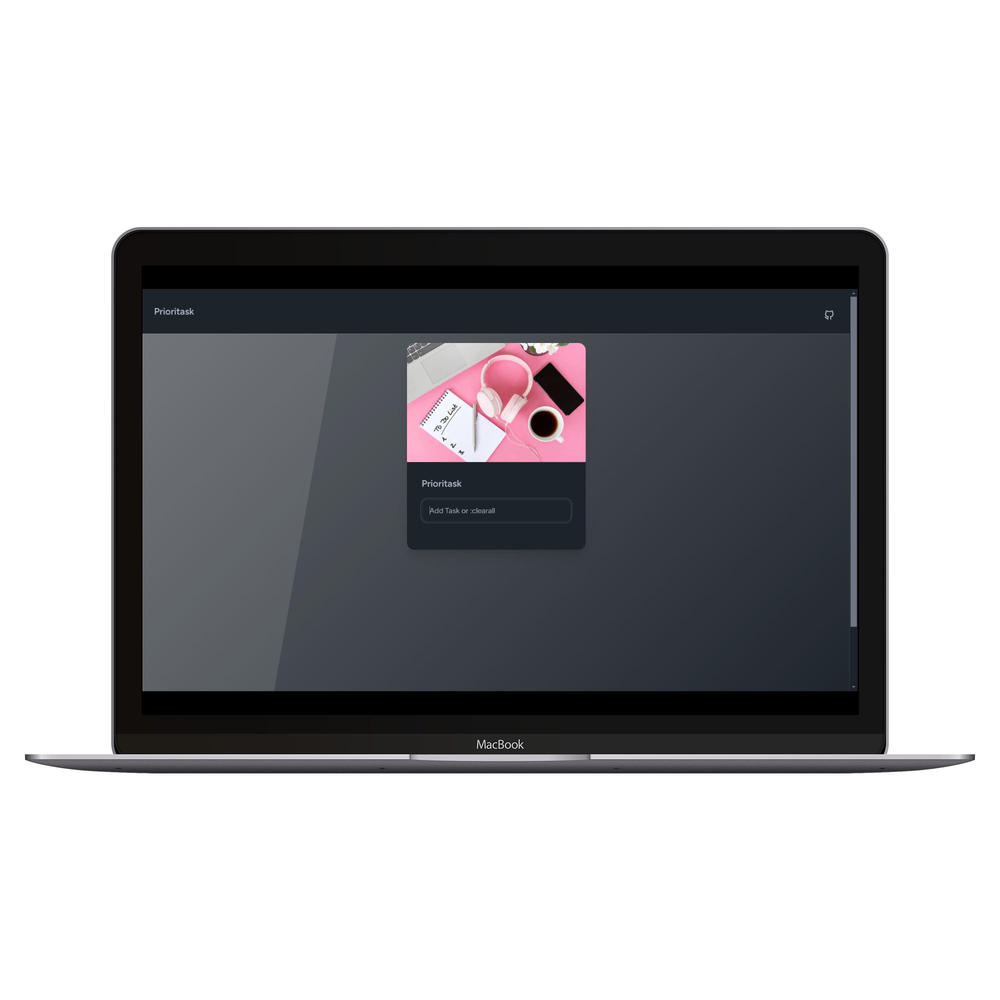
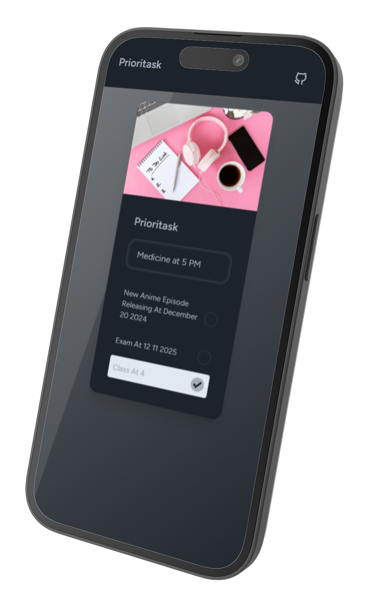

# Prioritask
- Prioritask is a simple task management web application built with vanilla JavaScript, designed to help users add, prioritize, and toggle the completion status of tasks. The app also supports clearing all tasks at once and stores tasks in the browser's local storage to persist data between sessions.

## Features
- Add tasks: Easily add tasks via a text input field.
- Prioritize tasks: Tasks are listed with the ability to toggle their completion status, with completed tasks appearing at the bottom.
- Persistent storage: Tasks are stored in the browser's local storage using localforage, ensuring data persistence across page refreshes.
- Clear all tasks: A special command (:clearall) allows users to clear all tasks from the list.

## Tech Stack

- *HTML/CSS*: Structure and styling of the app.
- *JavaScript*: The main logic for adding, removing, and updating tasks.
- *localforage*: Used for local storage to persist tasks.
- *Lodash*: For utility functions like sorting tasks.
- *FontAwesome/Tabler Icons*: For icons in the interface.

# Preview

